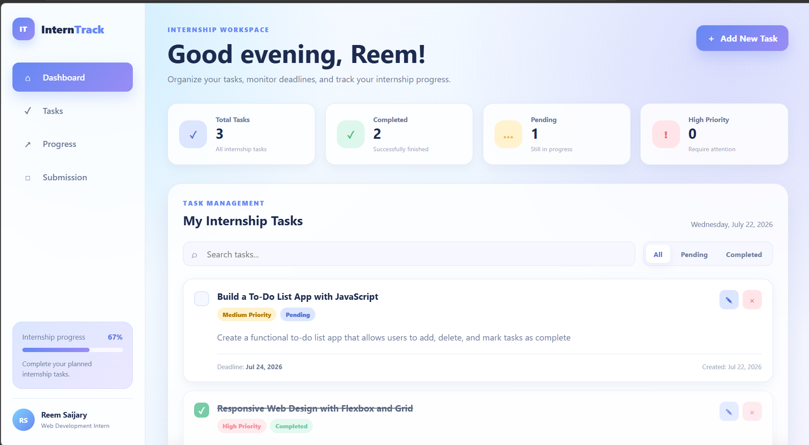
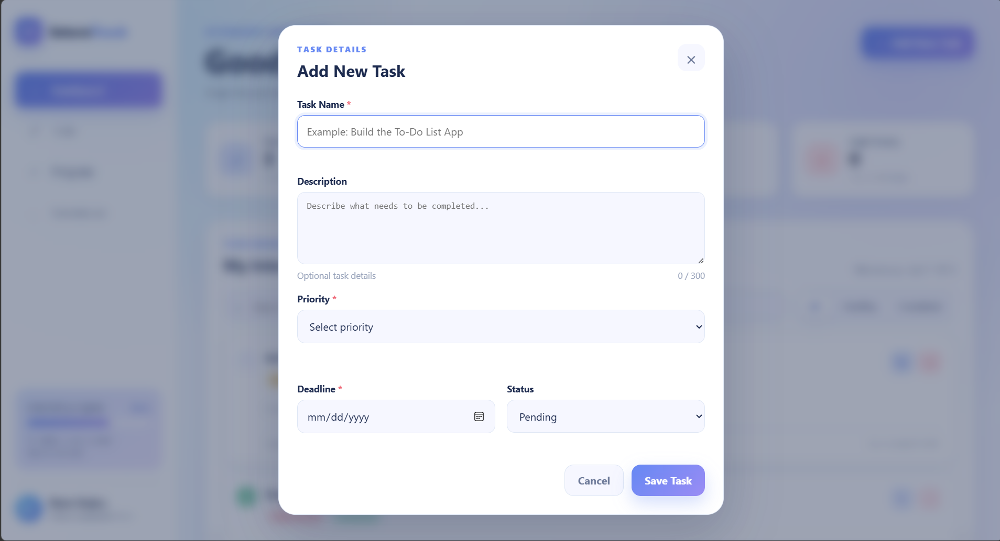
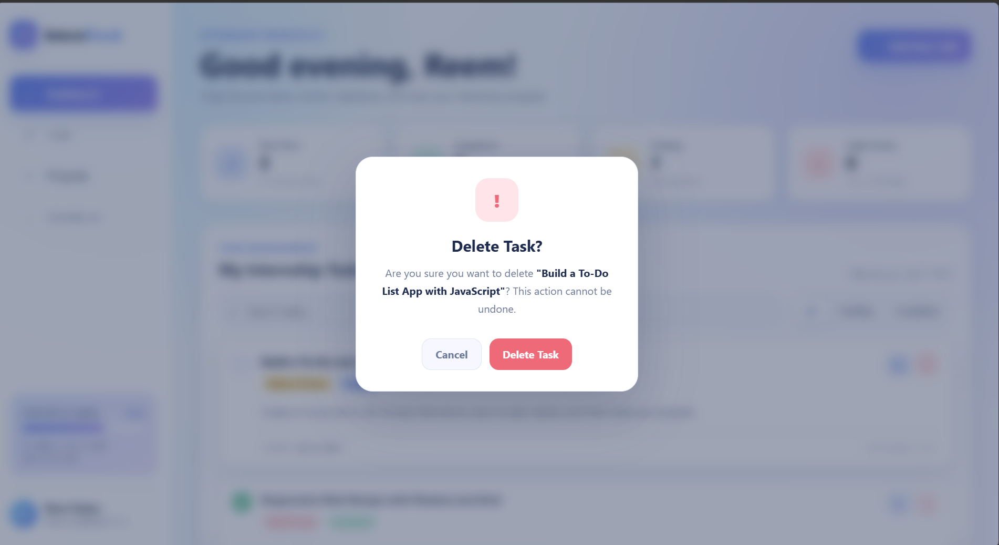

# InternTrack – Internship Task Manager

A modern, responsive task management application built with **HTML5, CSS3, and Vanilla JavaScript** for organizing internship tasks, tracking progress, and managing deadlines.

This project was developed as part of the **Codveda Technologies Web Development Internship (Level 2 Task)**.

---

## Live Demo

Coming soon...

---

## Screenshots


| Dashboard                                 | Add Task                                |
|-------------------------------------------|-----------------------------------------|
|  |  |

| Delete Confirmation                       |      |


---

# Features

## Task Management

- Add new internship tasks
- Edit existing tasks
- Delete tasks using a custom confirmation modal
- Mark tasks as completed or pending
- Store all tasks in Local Storage
- Automatic data persistence after page refresh

---

## Task Information

Each task includes:

- Task Name
- Description
- Priority (Low / Medium / High)
- Deadline
- Status
- Creation Date

---

## Search & Filtering

- Search tasks instantly
- Filter by:
  - All
  - Pending
  - Completed
- Search and filters work together

---

## Dashboard

The dashboard automatically displays:

- Total Tasks
- Completed Tasks
- Pending Tasks
- High Priority Tasks
- Overall Progress Percentage

Statistics update automatically whenever tasks change.

---

## User Experience

- Responsive layout
- Mobile navigation
- Sticky sidebar
- Empty state for first-time users
- Empty state for search results
- Character counter
- Form validation
- Smooth modal animations
- Custom delete confirmation modal
- Overdue task detection

---

## Responsive Design

The application is fully responsive for:

- Desktop
- Laptop
- Tablet
- Mobile

---

# Technologies Used

- HTML5
- CSS3
- JavaScript (ES6+)
- Local Storage API

---

# Project Structure

```text
InternTrack/
│
├── index.html
│
├── css/
│   ├── style.css
│   └── responsive.css
│
├── js/
│   ├── app.js
│   ├── ui.js
│   └── storage.js
│
└── README.md
```

---

# Application Workflow

## 1. Add Task

The user can create a new internship task by providing:

- Title
- Description
- Priority
- Deadline
- Status

The application validates required fields before saving.

---

## 2. Edit Task

Existing tasks can be edited without changing their creation date.

---

## 3. Delete Task

Deleting a task opens a custom confirmation modal before permanently removing it.

---

## 4. Complete Task

Tasks can be marked as completed or returned to pending.

The dashboard statistics and progress update automatically.

---

## 5. Search & Filter

Users can quickly find tasks using:

- Keyword search
- Status filters

Both features can be combined.

---

## 6. Data Persistence

All tasks are stored using the browser's Local Storage.

Closing or refreshing the browser does not remove saved tasks.

---

# JavaScript Architecture

The project follows a modular structure.

## app.js

Responsible for:

- Application state
- Event listeners
- Task CRUD operations
- Search
- Filtering
- Validation
- Modal management

---

## ui.js

Responsible for:

- Rendering task cards
- Dashboard statistics
- Progress bar
- Empty states
- Task formatting
- Dynamic UI updates

---

## storage.js

Responsible for:

- Loading tasks
- Saving tasks
- Local Storage management

---

# Validation

The application validates:

- Minimum task title length
- Required priority
- Required deadline
- Character count for descriptions

---

# Accessibility

The project includes:

- Semantic HTML
- Accessible labels
- Keyboard support
- ARIA attributes
- Focus management
- Screen-reader friendly elements

---

# Future Improvements

Potential future enhancements include:

- Task categories
- Drag & Drop
- Due today filter
- Dark mode
- Task sorting
- Export tasks
- Cloud synchronization

# Author

**Reem Saijary**

Computer Science Graduate

GitHub: https://github.com/reemsaijary

LinkedIn: https://linkedin.com/in/reemsaijary